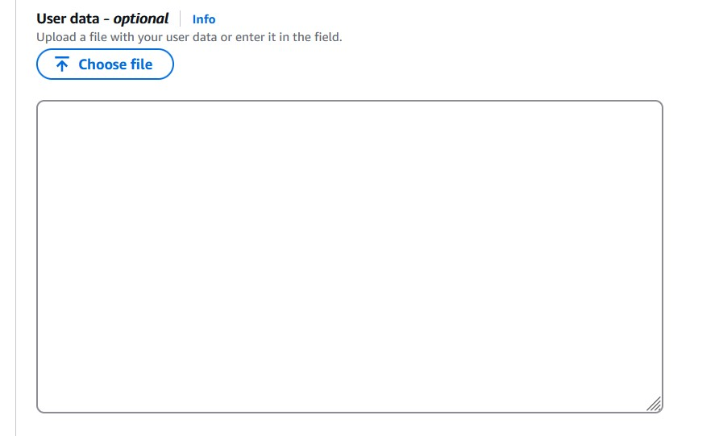

# AWS User Data Script - README

## 🚀 Usage
1. Copy the script `user-data.sh`, modify it, and paste it as User Data.
   
2. Provide the script as user data when launching an AWS EC2 instance.
3. Once the instance is running (wait a few minutes, check the status checks), log in to Splunk Web and verify the installation.
4. You don't need to go to the terminal!
<!-- >[!NOTE] -->
> **📝 NOTE**
> - The script is designed for Ubuntu/Debian-based systems and uses Splunk Version 9.1.6.
> - A system reboot may be required for some changes to take effect.

---

## 📌 Overview
This script automates the setup of an AWS EC2 instance by installing required packages, configuring system settings, creating users, and installing Splunk. It ensures a smooth deployment process while implementing best security and performance practices.

## 🌟 Features
- ✅ Updates the OS and installs essential packages
- 🔄 Sets up cron jobs for log maintenance
- 🕒 Configures Bash history and user session timeout
- 👤 Creates necessary users and assigns permissions
- 📈 Updates system resource limits
- ❌ Disables Transparent Huge Pages (THP)
- 📥 Installs and configures Splunk
- 🔒 Enables Splunk boot-start and SSL for web access
- 🎉 Displays a success message upon completion

---

## 🛠️ Script Breakdown

### 1️⃣ Update OS and Install Required Packages
The script updates the system and installs essential utilities such as `vim`, `htop`, `git`, `chrony`, and more.

### 2️⃣ Setup Crontab for Log Maintenance
A cron job is created to delete logs older than two days from `/opt/syslog/` every hour.

### 3️⃣ Configure Bash History with Timestamps
Enhances shell history tracking by including timestamps.

### 4️⃣ Configure User Session Timeout
Automatically logs out inactive users after 5 minutes (300 seconds).

### 5️⃣ Ensure Default Shell is Bash for New Users
Modifies `/etc/default/useradd` to set Bash as the default shell.

### 6️⃣ Create and Configure Users
- Adds `splunk` and `atlgsdachedu` users if they don't exist.
- Grants `atlgsdachedu` sudo privileges without a password prompt.
- Adds `atlgsdachedu` to the `splunk` group.

### 7️⃣ Revert Default Shell to `sh`
Restores the system's default shell setting after user creation.

### 8️⃣ Set Password Requirements
Enforces a minimum password length of 8 characters.

### 9️⃣ Update System Resource Limits
- Increases file descriptor limits (`NOFILE`) to 64,000.
- Increases process limits (`NPROC`) to 16,000.
- Sets the maximum allowed tasks to 80%.

### 🔟 Disable Transparent Huge Pages (THP)
Prevents performance issues by disabling THP at boot.

### 1️⃣1️⃣ Setup Splunk Directory
Creates `/opt/splunk` and assigns ownership to the `splunk` user.

### 1️⃣2️⃣ Set File Permissions
Uses `setfacl` to grant Splunk access to `/var/log/`.

### 1️⃣3️⃣ Message of the Day (MOTD) Setup
Updates the system MOTD to display a custom message.

### 1️⃣4️⃣ Enable and Start Chrony Time Sync
Ensures accurate time synchronization.

### 1️⃣5️⃣ Set SPLUNK_HOME Environment Variable
Defines `SPLUNK_HOME` as `/opt/splunk` for system-wide use.

### 1️⃣6️⃣ Create Splunk Admin Seed File
Prepares a default admin user for Splunk.

### 1️⃣7️⃣ Download Splunk TAR File
Fetches the Splunk installation package if not already present.

### 1️⃣8️⃣ Extract and Install Splunk
Extracts the package and moves configuration files into place.

### 1️⃣9️⃣ Configure Splunk Boot-Start
Enables Splunk to start at boot under the `splunk` user.

### 2️⃣0️⃣ Enable Splunk Web with SSL
Configures Splunk Web to use SSL and TLS 1.2 for security.

### 2️⃣1️⃣ Start Splunk
Starts the Splunk service under the `splunk` user.

### 2️⃣2️⃣ Display Success Message
Uses `cowsay` to display a friendly message upon successful installation. *(Optional)*

---

## 📜 License
This script is provided as-is with no warranties. Modify and use it at your own discretion.

